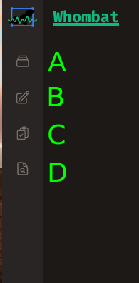
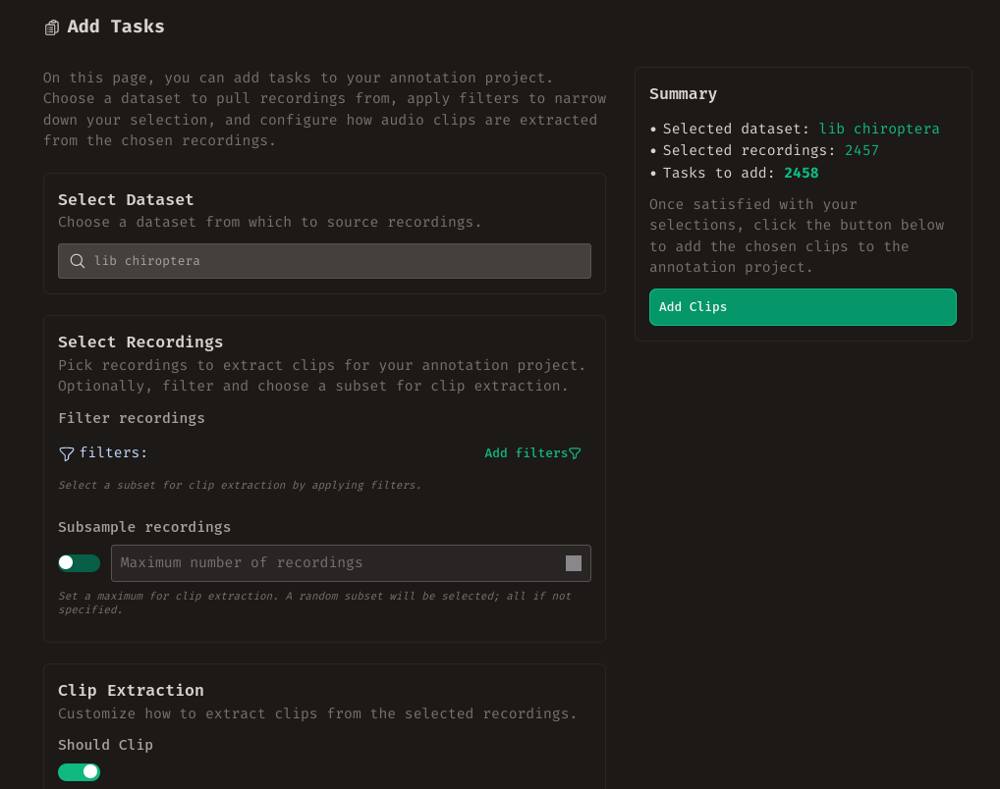
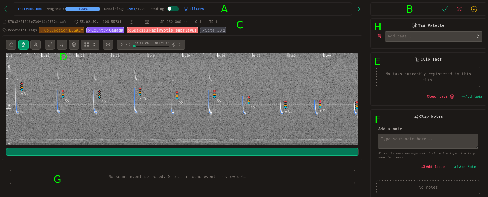

# Audio Annotation

Welcome to the core of **Whombat**: **Annotation Projects**.
This is where the real work gets done.
It's where you and your fellow annotators can dive deep into your audio data, applying your expertise to identify, classify, and annotate important sound events.

In this section, we will guide you through various topics:

1. [**Understanding Annotation**](#understanding-annotation): Delve into the fundamentals of annotation.
2. [**Getting Started with Annotation**](#getting-started-with-annotation): Learn how to initiate your annotation work in Whombat.
3. [**Creating or Importing an Annotation Project**](#creating-or-importing-an-annotation-project): Explore the steps to set up a new project or import an existing one.
4. [**Selecting Annotation Tags**](#selecting-annotation-tags): Understand the importance of selecting the right tags for annotation.
5. [**Adding Annotation Tasks to a Project**](#adding-annotation-tasks-to-a-project): Discover how to enhance your project with specific annotation tasks.
6. [**The Annotation Project Dashboard**](#the-annotation-project-dashboard): Navigate through the project dashboard for a comprehensive overview.
7. [**Annotating a Clip**](#annotating-a-clip): Dive into the actual process of annotating a clip with precision.
8. [**Exporting the Data**](#exporting-the-data): Learn how to export annotated data for further analysis or sharing.

!!! tip "Explore Whombat with Example Data"

    Want to see Whombat in action without starting from scratch? Import the example dataset and annotation project to explore the interface and functionality with pre-populated data.
    Check out the [import data guide](import.md) for step-by-step instructions.

## Understanding Annotation

Annotation in audio is about adding human-interpretable meaning to raw audio data, and it can take various forms.
For instance, attaching a tag to a recording constitutes a form of annotation.
However, Whombat primarily centers on two types of annotation.

The first type is annotating **sound events**.
In Whombat, a sound event encompasses any distinguishable sound of interest to the annotator.
To annotate a sound event, the annotator marks the RoI in the spectrogram where the sound occurs and attaches tags or notes to it.

!!! info "Defining the RoI"

    The method an annotator uses to mark the RoI for each sound event can vary,
    depending on the type of sound being annotated. Whombat provides multiple
    approaches for this. For instance, annotators can use a bounding box to
    encompass the starting and ending time of the sound event, along with its
    lowest and highest frequency. Alternatively, annotators may choose to mark only
    the exact moment in time when the sound occurs, particularly for short pulses.

The second type is annotating an audio **clip**.
Annotations for a clip in Whombat involve attaching tags or creating notes for the entire clip, not for a specific sound within it.
However, when annotating a clip, the annotator can, of course, create annotations for the sound events within the clip.

!!! info "What is a Clip?"

    In Whombat, an audio clip is a portion of a complete recording, like the
    first second of a soundscape. Surprisingly, the entire recording can also be
    seen as a clip, and even a clip extending beyond the recording's end is valid.
    Whombat leans on clips for annotation because they offer a standardized and
    more manageable way of annotating. Imagine annotating a full 1-hour
    recording—clips make this task more feasible. Additionally, using clips of
    consistent duration within a project enhances comparability.

With these two ways of annotation, Whombat lets you describe audio details exactly as you need.

Annotation serves a specific purpose, whether it's reviewing all recordings from a dataset or gathering material for ML development.
To streamline this process, Whombat neatly organizes all annotation work into **annotation projects**.

An annotation project in Whombat comprises **annotation tasks**, a collection of audio clips awaiting annotation.
Each project should establish a clear criterion for what constitutes a successfully annotated clip.
Therefore, we encourage each project to provide explicit instructions on how to annotate.
As a best practice, designing a set of tags for consistent use across all annotation work within the project enhances efficiency and coherence.

## Getting Started With Annotation

Now that you're prepared to begin annotating, head to the annotation section by clicking the annotation button (labeled **B** in the figure) in the left sidebar or utilizing the navigation cards on the homepage.

Upon entering, you'll encounter a list of all registered annotation projects.
Locate the specific project you want to work on using the search bar and click on it.

## Creating or Importing an Annotation Project

If you want to initiate a new annotation project, click the **+Create** button at the top of the project list.
You'll be prompted to provide a **name** for the project, a **description** outlining its purpose and contents, and crucially, **annotation instructions**.

If you already have an exported annotation project file, you can import it by clicking the **Import** button and selecting your file.

??? tip "Crafting Effective Annotation Instructions"

    Whombat provides tools for annotation without prescribing specific
    annotation instructions. This can make the definition of completing an
    annotation task somewhat open-ended. When drafting annotation instructions,
    consider your project goals and align the instructions accordingly. For
    projects requiring annotators to determine if a clip contains a particular
    sound, provide specific guidance like "Review each clip, listen in full, and
    decide if it contains car sounds. If yes, add a 'sound:car' tag; otherwise,
    leave it empty." For annotating sound events, specify how to mark the RoI, the
    preferred geometry, and aim for precision. For example: "Use a bounding box to
    enclose each bat echolocation pulse, encompassing the main harmonic. Keep the
    boxes tight, utilize the -80dB threshold to cut off extraneous noise, and add
    the 'event:echolocation' tag for each pulse. Mark faint pulses but, if
    uncertain, add a tag indicating uncertainty."

## The Annotation Project Dashboard

After selecting or creating the desired annotation project, you'll be directed to the project dashboard.
Here, you'll find a summary of annotation progress, indicating how many tasks have been completed, how many have encountered issues, and how many are still pending.

You can also view and modify project information, including the description and annotation instructions.

??? warning "Deleting an Annotation Project"

    If needed, you have the option to delete an annotation project. However,
    exercise caution as this action permanently erases all annotations within the
    project. Ensure you are confident in this decision or have a backup in place.

Additionally, you can access basic statistics detailing the number of annotations made, categorized by tag.
Finally, you'll find a section highlighting the most recent issues within the project, facilitating quick resolution.

## Selecting Annotation Tags

Navigate to the "Tags" tab in the navigation header or click the "Manage Tags" button in the Tag Summary section of the dashboard to manage tags specific to this annotation project.
Here, you can view and search all currently whitelisted tags for annotation, remove existing ones, or introduce new ones.

Use the search bar on the left to find existing tags for addition or create new ones.
The tags listed on the right column are registered for the project.
Click on a tag to remove it.

!!! info "Restricted tag set"

    During annotation, annotators will only see tags registered in the project
    when searching. This helps prevent duplication and ensures the correct tags are
    consistently used.

??? tip "A well designed tag set"

    As tags can cover a wide range, agreeing on a set of tags for a project is
    essential. This ensures tags are easily interpretable and applicable. It's
    advisable to establish some tags before annotation, facilitating a smoother
    process and clearer task understanding for annotators. However, tags can be
    added progressively, so there's flexibility in this aspect. Don't feel
    pressured to finalize all tags from the start.

## Adding Annotation Tasks to a Project

As discussed in the [Understanding Annotation](#understanding-annotation) section, an annotation task involves a full annotation of an audio clip (based on the provided annotation instructions).
To add tasks to a project, click the "Add Tasks" button in the Progress Overview on the dashboard or press the "Tasks" button in the navigation header.

To add tasks to the project:

- Select a Dataset: Choose the dataset from which recordings will be sourced.
- Choose Recordings: Select specific recordings from the chosen dataset.
- Determine Clip Selection Method: Decide how to select clips from the chosen recordings.

The first step is straightforward.
However, for the second step, you have the option to include only a subset of all dataset recordings.
This can be achieved by applying filters to refine the set of recordings or by randomly subsampling from the entire set of recordings.

The clip selection step is equally crucial.
Here, you can choose between using the entire recordings as clips or using clips of a predefined duration.
The second option is the default, and if selected, you can configure the duration of each clip, the amount of overlap between consecutive clips, and the maximum number of clips to extract from each recording.

??? tip "Avoid Many Clips per Recording"

    Although having numerous annotated clips may seem beneficial, especially
    for training ML models, the number of clips can sometimes be misleading.
    Annotating many clips from the same recording may not provide fully independent
    examples as they share a common background. Therefore, the number of clips may
    not immediately reflect the dataset size. Whenever possible, it's preferable to
    have a few clips from many different recordings than numerous clips from a few
    recordings.

??? tip "Selecting an adequate clip duration"

    Choosing the right clip duration for the annotation task is a pivotal
    decision. A thoughtful selection should consider the goals of annotation, how
    annotators will create annotations, and ultimately, how the annotations will be
    utilized. If there are specific sounds to annotate, ensure the clip duration is
    longer than the typical duration of those sounds. This ensures the entire sound
    is encompassed, providing a sufficient buffer. Annotators will only have access
    to the audio clip and recording metadata, so it's vital to ensure the audio
    clip contains enough content for correct interpretation. Clips that are too
    short may be challenging to understand, while overly long clips may become
    tedious to annotate. Lastly, if the intention is to use annotations for
    training an ML model, consider the model's training requirements and input
    expectations.

## Annotating a Clip

When you're ready to start annotating, click on the "Annotate" button in the navigation header.
This action will open the annotation interface, as illustrated in the image below.

In this interface, you'll encounter one annotation task at a time, featuring the spectrogram of the corresponding clip and controls for adding annotations.
The primary annotation workflow involves reviewing the spectrogram, adding annotations, and marking the task as done, in need of review, or verified.

??? info "Verified status"

    It's common to conduct a second review of the annotations for accuracy.
    Whombat facilitates this by offering a "verified" status. This status indicates
    that the annotations were initially completed and subsequently verified
    independently.

Now, let's explore each section of the interface in more detail.

### Navigating the Annotation Tasks

At the top, you'll find an **Annotation Progress** bar (labeled **A** in the image) that provides information about the progress of annotation.
This includes the annotation instructions, progress monitoring, and task navigation.
To move to the next or previous task, use the arrows at the extremes of the bar.

!!! tip "Work on a subset of tasks"

    Utilize the filter menu to focus on a specific subset of annotation tasks.
    This feature is beneficial for team collaboration, allowing tasks to be
    distributed based on filtering conditions. For instance, one annotator may
    exclusively work on tasks associated with source recordings tagged as
    "Country:Mexico," while another focuses on those tagged with "Country:Costa
    Rica." This approach ensures annotators concentrate on priority tasks that
    require annotation.

### Reviewing the Task Status

At the top right (labeled **B**), you'll find the **Annotation Status** of the current viewed task.
If another annotator has marked the task as complete, in need of review, or verified, it will appear here as a badge.
Clicking on the badge allows you to remove that status if necessary.
The buttons on the right enable you to assign the corresponding status to the task.

### Providing Context to the Annotator

Below the Annotation Progress bar, you'll encounter a section displaying the **Recording Context** (labeled **C**).
Here, relevant metadata of the source recording is presented, including date, time, and location of the recording, along with any tags attached to the recording.
This contextual information aids in interpreting the sounds present in the displayed clip.

### Creating and Editing Sound Event Annotations

The **Clip Spectrogram** is a critical component with dedicated controls.
This section displays the spectrogram of the assigned clip for annotation, along with any existing sound event annotations.
The controls provided allow you to navigate, playback, and create new sound event annotations.
For detailed information on navigating the spectrogram, refer to the [Navigating the Spectrogram](spectrogram_display.md) section.
In the annotation interface, additional controls are available for creating annotations.
These include Select, Create, and Delete options.

- Use the **Select** option to hover over and choose a single annotated sound event by clicking on it.
    Once selected, you can **Edit** its RoI or view its details in the section below, including adding notes to this specific sound event (**Sound Event Detail**, labeled **G** in the figure).
- The **Delete** mode allows you to hover over and select a single sound event for deletion.
- Utilize the **Create** button to draw a RoI and generate a new sound event annotation.
    The dropdown menu in the annotation controls lets you choose the type of geometry to use.

!!! tip "Copying Annotations"

    In scenarios where multiple similar-looking sound events occur within a single
    clip, you can efficiently annotate them by creating a single sound event,
    adding all the relevant tags, and then copying the annotation to create clones.
    To achieve this, select the desired annotation, press the Control key, and drag
    a copy to the desired location. This feature streamlines the annotation process
    for repetitive sound events.

All annotations will be visible in the spectrogram alongside the current tags.
A button next to the tags of a sound event annotation enables you to add more tags.
Alternatively, click on a single tag to remove it from the annotation.

### Annotating the Task Clip

Adjacent to the spectrogram, you'll find two essential sections for annotating the clip:

- **Clip Tags** Section (**E**): Use this section to attach tags to the entire audio content within the clip.
- **Clip Notes** Section (**F**): Employ this section to add any relevant notes pertaining to the clip.

### The Tag Palette

Directly above these sections is the **Tag Palette** (**H**): a powerful tool for expediting annotations.
The Tag Palette allows you to store an assortment of annotation tags for easy access across different tasks.
It serves two primary purposes:

- Automatic Tag Attachment: When creating a new sound event annotation, all tags in the palette are automatically attached to the annotation.
- Efficient Tag Addition: Clicking on a tag in the palette instantly adds it to the clip tags, streamlining the annotation process.

!!! tip "Annotating Multiple Instances of the Same Sound:"

    Every new sound event annotation automatically inherits all tags from the
    palette. This is particularly useful for annotating multiple sounds of the same
    source.

!!! tip "Quickly Classify Clips"

    Streamline the classification of audio clips by pre-selecting and keeping
    relevant tags in the palette. During clip review, a simple click on the
    appropriate tag completes the task.

!!! tip "Adding Recording Tags to the Palette"

    Clicking on a tag in the Recording Context section adds it to the Tag
    Palette. This is valuable, especially when all recordings are associated with
    known species. During annotation, you can utilize the recording-level tag and
    add it to the palette for precise sound event tagging.

### Keyboard Shortcuts

To enhance the speed of the annotation process, Whombat provides a set of convenient keyboard shortcuts for common actions.
Refer to the table below for an overview of these shortcuts:

| Keys  | Description                                                             |
| ----- | ----------------------------------------------------------------------- |
| ++z++ | Activate the **Zoom** mode of the spectrogram                           |
| ++x++ | Deselect everything and return to the **Drag** mode of the spectrogram  |
| ++a++ | Enter the **Create** new sound event mode to initiate drawing a new RoI |
| ++s++ | Activate the **Select** mode to hover an select a single sound event    |
| ++d++ | Activate the **Delete** mode to hover, select and delete a sound event  |
| ++g++ | Mark the current task as **Completed** (Good)                           |
| ++r++ | Reject the current task or mark as in need for **Review**               |
| ++v++ | Mark the current task as **Verified**                                   |
| ++n++ | Proceed to the **Next** annotation task                                 |
| ++p++ | Navigate to the **Previous** annotation task                            |

## Exporting the Data

Upon completing your diligent annotation work, you have the option to export all the annotations from your project for various purposes.
Follow these steps:

- Navigate back to the project dashboard.
- Click on the download button located in the top-right corner of the dashboard.

This action will generate a single JSON file containing all the annotations in the AOEF format.
For more details on the format, refer to this [website](https://mbsantiago.github.io/soundevent/).
The exported file can be easily shared with others, allowing them to import it directly into Whombat and view your annotations (assuming they have the recordings pre-registered, check [Sharing Datasets](datasets.md) for more information).
Sharing your annotations becomes a seamless process, enabling collaborative efforts and knowledge exchange.

## Conclusion

Congratulations! You are now well-equipped to successfully manage and execute your annotation projects in Whombat.
Whether you're diving into the [Evaluation section](evaluation.md) to gain insights into the performance of ML models and user annotators, or exploring the data further using the tools in the [Exploration section](exploration.md), you have a solid foundation to make the most of your annotations.

*[RoI]: Region of Interest
*[ML]: Machine Learning
*[JSON]: JavaScript Object Notation
*[AOEF]: Acoustic Object Exchange Format
