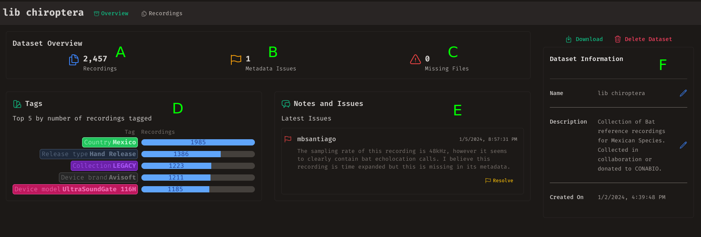
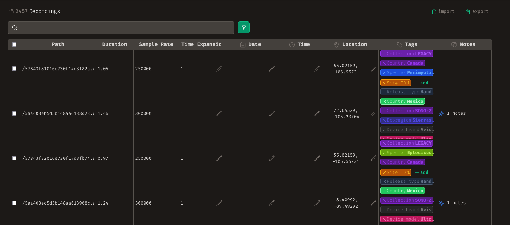
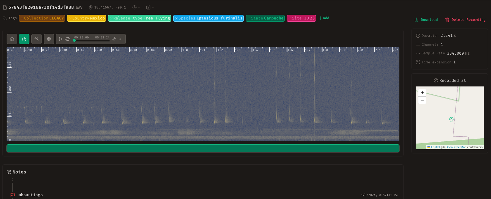

# Managing Datasets and Recordings

In Whombat, you have the flexibility to efficiently manage multiple recording
datasets.

!!! info "What is a dataset?"

    A dataset, simply put, is a collection of recordings. However, these
    recordings typically share a common context, whether it's from a single research
    project, a specific field season, or files downloaded from a particular website.
    While you can structure your datasets as you prefer, creating coherent datasets
    is generally considered good practice.

Navigate to the dataset list using the sidebar or the cards on the homepage.

## Selecting a Dataset to Work On

On the dataset list page, you'll find an overview of all available datasets.
Clicking on the name of a dataset takes you to a dedicated page where you can
explore its details and the recordings it contains.

## Create a dataset

To create a new dataset, click the **+Create** button. You'll be prompted to
provide a name and a description for your dataset. Additionally, paste the full
path of the folder containing the recordings you want to add. Whombat will scan
the folder and automatically include all available audio files it can find.

??? info "Supported Audio Formats"

    Currently, Whombat exclusively supports WAV files. However, we're actively
    exploring the possibility of adding support for FLAC files.

!!! tip "Audio file preparation"

    Ensure that all dataset files are contained within the dataset folder.
    Prepare this folder before creating the dataset. While moving files, refrain
    from making any other modifications. Editing files may unintentionally erase
    crucial metadata associated with the recording.

??? info "Whombat Audio Folder"

    Whombat can only detect files located in your home folder. If you're using
    an external hard drive, copy the recordings you wish to annotate into your home
    folder. If you wish to modify this configuration, feel free to reach out.

Whombat automatically extracts fundamental information from each discovered
file, such as recording **duration**, **sampling rate**, and the number of
**audio channels**. While Whombat can store additional details like date, time,
and location of the recording, automatic extraction is not applied due to the
diverse formats in which this information can be stored. Manual input is
required for these specific details.

## Import a dataset

Whombat offers a convenient option to import all dataset information from a
file. Currently, we support datasets in a JSON-based format known as AOEF. Refer
to this [link](https://mbsantiago.github.io/soundevent/) for comprehensive
information about the AOEF format.

To import a dataset, simply click the **import** button. Select the JSON file
you want to upload and provide the path to the directory where the recordings
are stored.

??? note "What path should I provide?"

    AOEF files contain information about recordings, with each recording's path
    stored relative to a **dataset audio directory**. This design ensures
    portability, allowing others to download all dataset audio files into a custom
    folder. You can then import the dataset file by pointing to this custom folder.

## Dataset Home Page

Upon selecting or creating a dataset, you'll be directed to the dataset detail
page, offering a comprehensive overview of your dataset. Here, you'll find key
statistics, including the total number of recordings. Additionally, the page
provides insights into potential issues with files or their metadata, along with
a detailed breakdown of the recording count.

From this dashboard, you can easily handle your dataset in various ways. **A)**
shows the total number of recordings, while **B)** points out any issues found
for specific recordings. **C)** Highlights recordings that were initially
registered but are currently missing from your files, offering essential
visibility. **D)** Gives a breakdown of the recordings based on tags, helping
you organize efficiently. **E)** Showcases the latest recording issues and
notes. Lastly, **F)** provides detailed information about the dataset and allows
for easy editing.

!!! warning "Deleting the dataset"

    If you've made a mistake or need to remove a dataset for any reason,
    there's a delete button in the dashboard. Keep in mind that using this button
    will erase all recordings within the dataset, along with any work, including
    annotations, associated with those recordings. Please ensure you fully
    understand the consequences before proceeding.

!!! info "Sharing your dataset"

    The dashboard also provides a button to download the dataset, allowing you
    to obtain metadata for all recordings. You can choose between a CSV or JSON
    format. If you plan to share the dataset with others, we recommend using the
    JSON format. This file enables your partner to effortlessly import all
    information into Whombat, assuming they also possess the corresponding audio
    files.

## Manage the Recordings Metadata

To access the table of recordings, simply click on the Recordings button in the
navigation header. Within this table, you can conveniently edit the metadata of
your recordings in a tabular format. This includes manually inputting the date
and time of recording, specifying the location where the recording was made, and
most importantly, adding any number of tags to your recordings.

!!! tip "Tag your recordings"

    Whombat leverages tags throughout the system to improve data organization
    and provide additional context to associated objects. In Whombat, tags consist
    of a pair of text values referred to as **key** and **value**, giving each tag
    a unique meaning. The key specifies the category to which it belongs, while the
    value provides a specific meaning. For example, a tag's key could be "species"
    and its value could be "Myotis myotis". Feel free to create any tag with any
    key and value, allowing you the flexibility to organize your tags as needed.

!!! info "Tags as Recording Context"

    Tags serve a dual purpose by not only organizing and querying your dataset
    but also providing essential context. When attached to a recording, tags act as
    snippets of information, offering details about the where, how and when of a
    recording. Displayed in the annotation interface, these tags equip annotators
    with valuable context, aiding in the interpretation and identification of the
    sometimes enigmatic sounds.

!!! tip "Efficient Recording Search"

    Easily find a recording using the search bar by entering a filename-related
    query. To further refine your view, apply filters through the
    :fontawesome-solid-filter: filter menu. Identify your desired filters, set them
    up, and see them displayed in the filter bar. To remove a filter, just click on
    its badge. Simplify your recording navigation with these helpful search and
    filter features.

## See the Recording Spectrogram

If you want to view the spectrogram of a recording, simply click on the path of
the recording. This will lead you to a dedicated page where you can access all
the recording information, visualize the spectrogram, and play the recording.
Additionally, you have the option to edit the recording metadata directly from
this page.

!!! tip "Adding Notes to the Recording"

    On this page, you can view existing notes attached to the recording and add
    your own. Notes can include any information you find relevant. If you notice
    any issues with the recording or its metadata, adding a note and flagging it as
    an issue ensures that you or others can address the problem later.

!!! warning "Deleting a recording"

    Deleting a recording is also possible, but exercise caution as it will
    erase any annotations associated with this recording.

## Navigating the Spectrogram

Navigating a spectrogram might seem intricate, but Whombat simplifies the
process with various tools tailored to customize the visualization according to
your preferences.

Typically, you'll only view a segment of the entire spectrogram due to the
length of some recordings. To address this, use the controls (labeled **A** in the
figure):

- Activate the hand icon to move around by dragging inside the spectrogram
  (default mode).
- Opt for the zoom icon to draw a box for a closer look.
- Click the home button to reset your view to the initial state.

At the bottom of the spectrogram is the spectrogram bar (labeled **B**), acting like
a scroll bar for swift navigation to distant parts of the spectrogram.

??? tip "Mastering Keyboard Shortcuts"

    Utilize ++shift+scroll++ to move left and right, and ++ctrl+scroll++ to zoom. Adding
    the ++alt++ key to scrolling transforms it into a zoom function. Press ++z++ to enter
    zoom mode and ++x++ to return to drag mode.

Next, explore spectrogram settings (labeled **C**). Pressing this button reveals a
side menu where you can modify spectrogram parameters to suit your specific
recordings.

!!! tip "Saving Parameters"

    Changes to parameters apply only to the current spectrogram. To keep these
    settings for all spectrograms, hit the save button on top.

Finally, there's the audio player (labeled **D**). Control playback, pause, seek to
any moment, and adjust the playback speed. You can also commence playback by
double-clicking the spectrogram at your desired starting point.

## Ready to start annotating

Now that you've registered a dataset and ensured its metadata is accurate,
you're all set to begin annotating your audio material. Head to the next section
to learn how to create and manage an annotation project.
