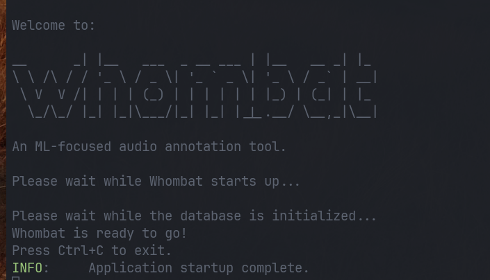
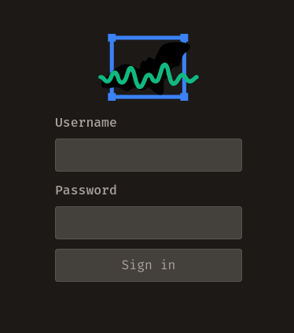
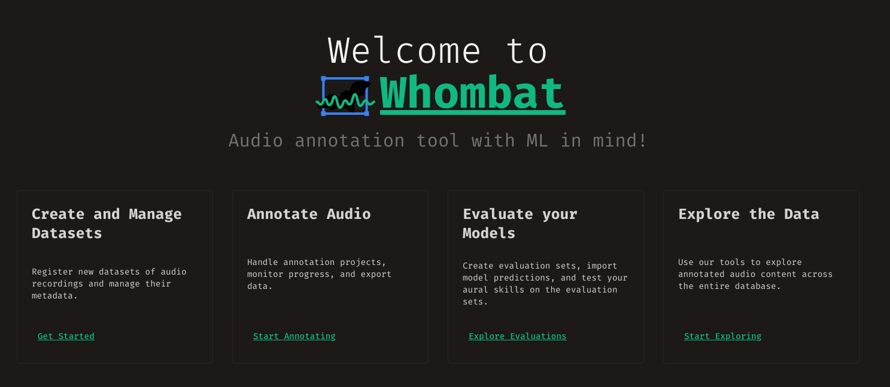

# Installation

Getting Whombat up and running is a breeze! We offer two straightforward methods
to suit your preferences and needs.

??? note "Whombat on the cloud"

    Interested in hosting a publicly accessible and collaborative instance of
    Whombat? Let us know, and we'll be more than happy to guide you through the
    process.

## Installation Methods

### 🐳 Docker (Recommended)

The easiest and most reliable way to run Whombat is using Docker. This method works on all platforms and ensures a consistent environment.

**Prerequisites:**
- [Docker Desktop](https://www.docker.com/products/docker-desktop/) installed on your system

**Quick Start:**

```bash
# 1. Clone the repository
git clone https://github.com/mbsantiago/whombat.git
cd whombat

# 2. Configure settings
cp .env.example .env
# Edit .env to set your audio directory path

# 3. Start Whombat
./scripts/docker.sh start
```

Whombat will be available at http://localhost:5000

For detailed Docker instructions, see our [Docker Guide](../../DOCKER.md).

### 📦 Standalone Executable

Download our pre-packaged executable file for Windows, Mac OS, or Ubuntu from our GitHub repository's [releases](https://github.com/mbsantiago/whombat/releases) section.

This is a good option if you prefer not to use Docker and want a simple double-click installation.

### 🐍 Python Package

If you're comfortable with Python and want to integrate Whombat into your Python environment:

```bash
pip install whombat
```

This method is ideal for developers who want to customize Whombat or integrate it into their workflow.

??? tip "Which installation method should I choose?"

    - **Docker**: Best for most users. Easiest setup, works everywhere, isolated environment.
    - **Standalone Executable**: Good for users who want a simple desktop application.
    - **Python Package**: Best for developers and advanced users who need customization.

## Running Whombat

How you start Whombat depends on your installation method:

### Docker Installation

```bash
# Start Whombat
./scripts/docker.sh start

# View logs
./scripts/docker.sh logs

# Stop Whombat
./scripts/docker.sh stop
```

Then open your browser and navigate to http://localhost:5000

### Standalone Executable

Double-click on the executable file. This action spawns a new window that should resemble the following:



After the window displays the "ready" message, a browser will automatically open, or you can manually navigate to:

    http://localhost:5000

### Python Package

To start Whombat using the Python installation, run:

```bash
python -m whombat
# or simply
whombat
```

Then open your browser and navigate to http://localhost:5000

## First User

If this is your initial encounter with Whombat, you'll be greeted with a screen
to create your user profile. Please enter your details and set up your user
account.

!!! info "Your Information"

    The details you provide here are stored locally on your computer and are
    not shared with others. However, if you decide to download and share a dataset
    or annotations, the information of the user who created them will be visible in
    the exported files. Therefore, your data will only be shared with the people
    you send these files to. If you wish to share your work, it is essential to
    provide your information so that others can attribute you correctly and contact
    you if needed.

## Login

For returning users, Whombat welcomes you with a login form. Enter your username
and password to access the home page. Whombat's user system supports multiple
users, allowing for individual work tracking.



## Home Screen

Welcome to the Whombat Home screen! After logging in, your view should resemble
the image below:



From this central hub, you're all set to dive into your audio annotation
journey. Navigate using the sidebar or the cards presented on the home page.
Whether you're managing datasets, creating annotation projects, or exploring
model predictions, the Home screen is your launchpad to your annotation work.
