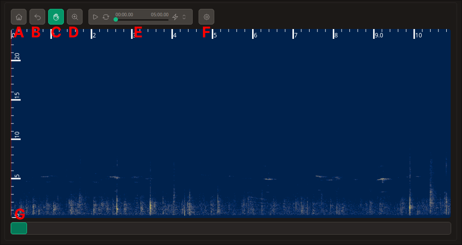

# Spectrogram Display

Visualizing audio with spectrograms is key to making accurate annotations, and Whombat makes the process easier with tools to tailor the display to your needs.

You'll typically only view a segment of the full spectrogram to focus on specific parts or to keep things running smoothly.

??? info "Spectrograms in Chunks"

    Whombat avoids calculating the entire spectrogram at once. Instead, it works in manageable chunks, letting you navigate your audio effortlessly. Only the visible chunks (and a few nearby) are computed, so you can zoom out and watch as Whombat fills in the rest in real time.

Whombat offers several ways to move around your spectrogram. We'll cover each method below, with the labeled spectrogram as your guide.

## Moving Around

### Dragging

The simplest way to navigate is by dragging. Just click anywhere on the spectrogram and drag to move around. But remember, this only works if dragging is enabled. Check the toolbar – if the drag button (C) is active, you're good to go. If not, just click it to activate dragging.

You can also use the bar at the bottom (G), which shows a mini version of the whole spectrogram. Click and drag the highlighted section to navigate.

### Scrolling

You can also navigate by scrolling.

Just hover your mouse over the spectrogram or the bar at the bottom, then use your scroll wheel:

- Scroll up and down: Move vertically through frequencies. Most likely you won't see any changes as the default behaviour is to display the full frequency range.
- Ctrl + Scroll: Move horizontally through time.

Zooming is just as easy:

- Ctrl + Scroll: Zoom in and out vertically (frequencies).
- Ctrl + Shift + Scroll: Zoom in and out horizontally (time).

### Double Clicking

Double-click on the spectrogram to center it at that point and start playback from there. Note that playback will only begin if it's already playing – otherwise, just hit the play button in the audio player (E).

## Zooming

Whombat offers a handy zoom feature beyond scrolling. To zoom in, simply click the zoom button (D) in the toolbar and then draw a box around the area you'd like to focus on.

Need to step back? Click the back button (B) to return to the previous view, or click the home button (A) to reset the zoom completely.

## Spectrogram Settings

Fine-tune your spectrogram's appearance by clicking the settings button (F) in the toolbar. This opens a handy side menu where you can adjust various parameters.

!!! tip "Saving Your Settings"

    Changes you make here only apply to the current spectrogram. To use these settings for all spectrograms, simply click the "Save" button at the top. You can also restore the default settings with the "Reset" button.

You have control over how audio is loaded, and how the spectrogram is calculated and displayed. Here's a breakdown of each setting:

| Setting             | Description                                                                                                                                                                 |
| ------------------- | --------------------------------------------------------------------------------------------------------------------------------------------------------------------------- |
| Resample            | Choose whether to adjust the audio to a specific sample rate. Helpful if your audio files have different sample rates.                                                      |
| Sample Rate         | The sample rate to use for resampling (only available if "Resample" is enabled).                                                                                            |
| Low Pass Filter     | Use the slider to set a low-pass filter. This can help remove high-frequency noise. A setting of 0 means no filtering is applied.                                           |
| High Pass Filter    | Use the slider to set a high-pass filter. This can help remove low-frequency noise. Setting this to the maximum value means no filtering is applied.                        |
| Window Size         | The length of time (in seconds) used to calculate the spectrogram. Shorter windows give better time resolution but worse frequency resolution, and vice versa.              |
| Overlap             | The percentage of overlap between windows. Higher overlap creates a smoother spectrogram but takes longer to compute.                                                       |
| Window Function     | The mathematical function used in the spectrogram calculation. The default is usually fine, but you can experiment if you'd like.                                           |
| De-noise            | Enable this to apply a noise reduction algorithm (PCEN) to your spectrogram.                                                                                                |
| Colormap            | Choose the color scheme for your spectrogram to suit your preferences.                                                                                                      |
| Amplitude Scale     | Select how amplitude (brightness) is displayed: amplitude, power, or decibel (logarithmic scale).                                                                           |
| Normalize Amplitude | Enable this to adjust the amplitude values to a 0-1 range. Useful for making quiet recordings easier to see.                                                                |
| Min Amplitude       | Set the minimum amplitude (in decibels) to display. Values below this are set to the minimum and assigned the corresponding color. This can help reduce noise.              |
| Max Amplitude       | Set the maximum amplitude (in decibels) to display. Values above this are set to the maximum and assigned the corresponding color. This can help highlight specific sounds. |

## Audio Player

At the top right, you'll find the audio player (E). Here, you can easily control playback, pause at any moment, jump to specific points in the audio, and even adjust the playback speed to match your workflow.

## Keyboard Shortcuts

Prefer to keep your fingers on the keyboard? Whombat has you covered with a variety of shortcuts to streamline your tasks:

| Key Combination         | Action                                   |
| ----------------------- | ---------------------------------------- |
| ++z++                   | Enter zoom mode                          |
| ++x++                   | Return to drag mode                      |
| ++"Scroll"++            | Move up and down in the frequency domain |
| ++shift+"Scroll"++      | Move left and right in the time domain   |
| ++ctrl+"Scroll"++       | Zoom in and out in the frequency domain  |
| ++ctrl+shift+"Scroll"++ | Zoom in and out in the time domain       |
